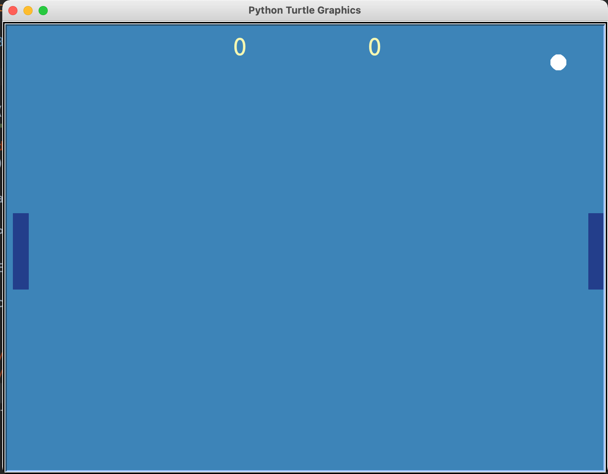
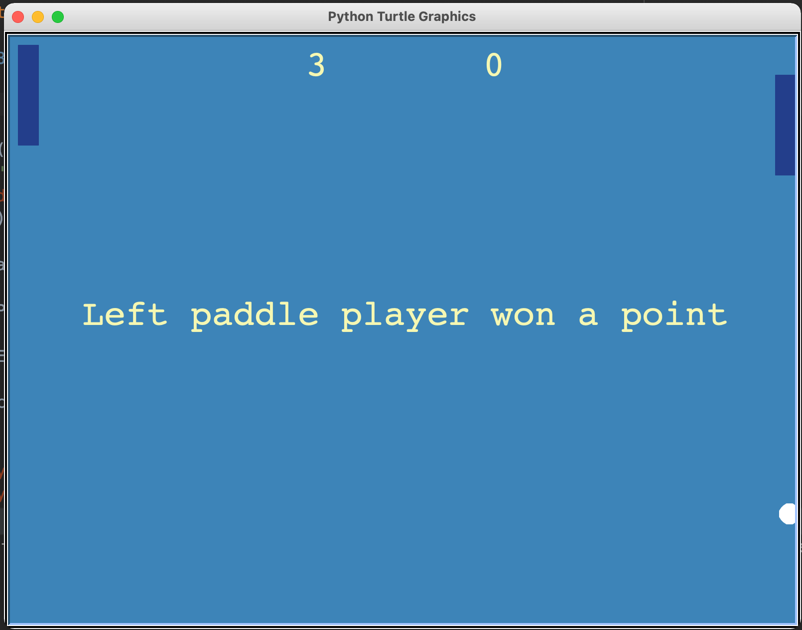
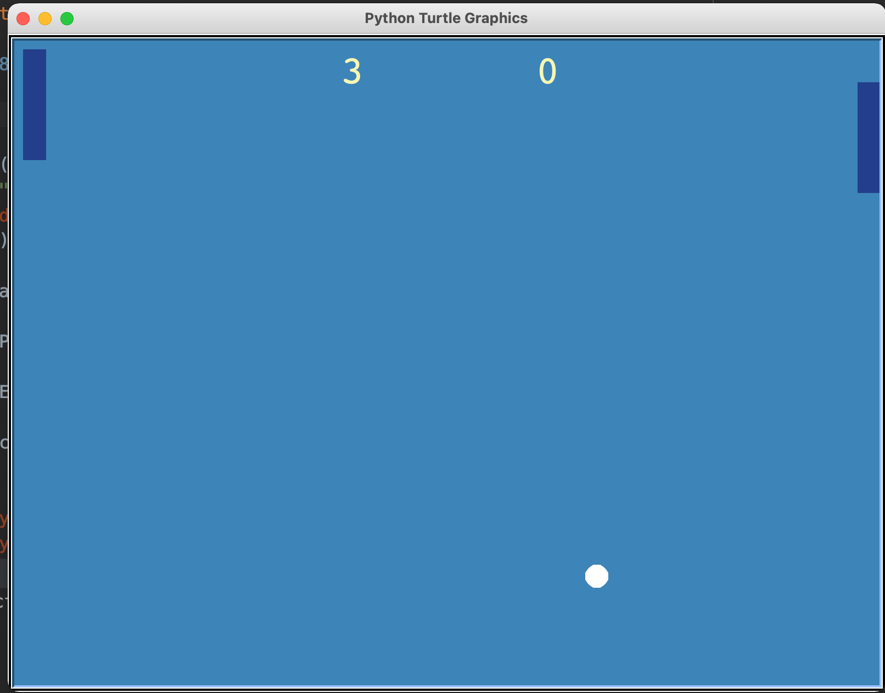
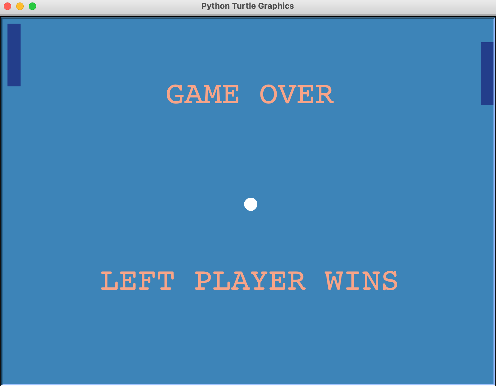

# Ping-Pong-game
A simple Ping-Pong game created using turtle graphics

# Preview
<table border:0>
  <tr>
    <td>  </td>
    <td>  </td>
  </tr>
  
  <tr> 
    <td>  </td>
    <td>  </td>
  </tr>

</table>

# Ping-Pong-game
  
## Controls for Player 1 [Left paddle]:
"w": Move Up
"s": Move Down

## Controls for Player 2 [Right paddle]:
"Up arrow": Move Up
"Down arrow": Move Down
